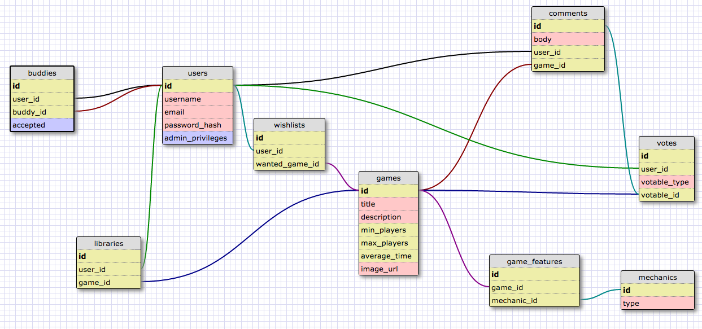

<!-- == README

This README would normally document whatever steps are necessary to get the
application up and running.

Things you may want to cover:

* Ruby version

* System dependencies

* Configuration

* Database creation

* Database initialization

* How to run the test suite

* Services (job queues, cache servers, search engines, etc.)

* Deployment instructions

* ...
 -->

### zero buddies present:

# Gamenight

_your friendly neighborhood board-game emporium_
  (look at all the things!)[http://dbc-gamenight.herokuapp.com/]

the **build**:

* Ruby 2.0.0

* Rails 4.2.4

* pure.css

the **works**:

   We've compiled a mega-list of games worth playing - take a look.  Find a game you own?
   Add it to 'your games'. Find a game you want? Add it to 'your wish list'.  As a first-time
   user, you'll have zero buddies (and thats okay, so do we), so make some friends, and add them to 'your buddies'.  They'll be able to see your lists, and perhaps even challenge you
   to a rousing game of CandyLand.  

   Just found the next 'Axis and Allies?'  Tell the world! Leave a comment :) 
   (Comments can be voted on so make it a good 'un)
   You can also view the comments you've made and find out how they stack up against other, lesser comments.  

the **why**:

    We felt there was a dire need for a _proper_, social-driven community devoted entirely to board-games.

the **who**:
Roger Daltrey, Pete Townshend, Keith Moon....

...**who** we are:
Bill Leidy, Alexis Moody, Chris Zajac

the **schema**

